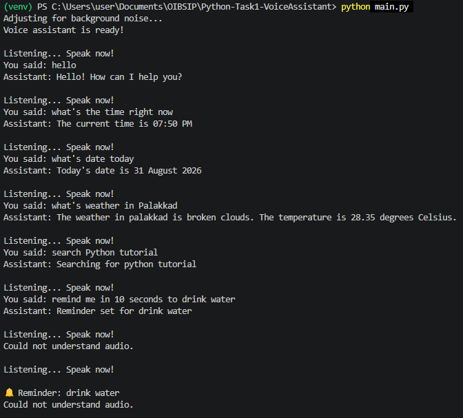
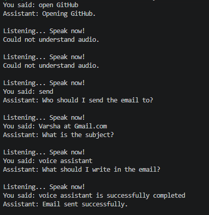
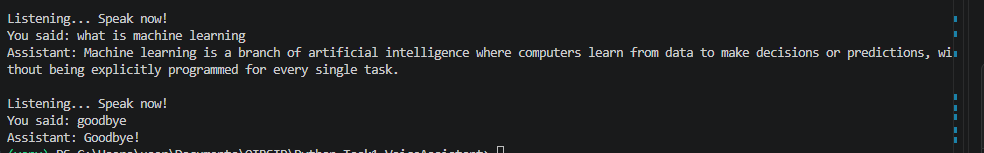

## Voice Assistant

A Python-based voice assistant developed during my Oasis Infobyte internship.

## Features

- Voice input using SpeechRecognition
- Text-to-speech responses using pyttsx3
- Natural language intent detection using NLTK
- Web search using Google
- Real-time weather information using OpenWeather API
- Voice-based reminders
- Email sending using Gmail SMTP
- General knowledge questions using Gemini AI
- Custom voice commands for opening websites
- Continuous voice interaction

## Technologies Used

- Python
- NLTK
- SpeechRecognition
- PyAudio
- pyttsx3
- Requests
- OpenWeather API
- Google Gemini API
- Gmail SMTP
- python-dotenv
- Web Browser

Python-Task1-VoiceAssistant/
│
├── main.py
├── nlp.py
├── intents.py
├── weather.py
├── reminder.py
├── email_sender.py
├── knowledge.py
├── custom_commands.py
├── requirements.txt
├── .gitignore
├── README.md
│
└── screenshots/
    ├── image1.png
    ├── image2.png
    ├── image3.png

## Installation

### 1. Clone the repository

git clone https://github.com/varsha3620/OIBSIP.git
cd Voice_Assistant

### 2. Create a virtual environment

python -m venv venv

### 3. Activate the virtual environment

venv\Scripts\activate

### 4. Install the required dependencies

pip install -r requirements.txt

### 5. Configure environment variables

OPENWEATHER_API_KEY=your_openweather_api_key
EMAIL_ADDRESS=your_gmail_address
EMAIL_PASSWORD=your_gmail_app_password
GEMINI_API_KEY=your_gemini_api_key

### 6. Run the voice assistant

python main.py

## Example Commands

### General Commands

- "Hello"
- "What time is it?"
- "What is today's date?"

### Web Search

- "Search for Python tutorials"
- "Look up machine learning"

### Weather

- "What's the weather in Palakkad?"
- "Tell me the weather in Kochi"

### Reminders

- "Remind me in 10 seconds to drink water"
- "Remind me in 5 minutes to check my project"

### Email

- "Send an email"

The assistant will ask for:
- Recipient
- Subject
- Message

### General Knowledge

- "What is Python?"
- "Who is Albert Einstein?"
- "Tell me about machine learning"

### Custom Commands

- "Open YouTube"
- "Open Google"
- "Open GitHub"
- "Open Gmail"
- "Open my portfolio"

## Security

This project uses environment variables to protect sensitive information.

The following credentials are stored in the `.env` file:

- OpenWeather API key
- Gemini API key
- Gmail address
- Gmail App Password

The `.env` file is excluded from Git using `.gitignore`.

Never share API keys, passwords, or App Passwords publicly.

Before uploading the project to GitHub, make sure that `.env` is not included in the repository.

## Author

Developed by Varsha P as part of the Oasis Infobyte internship.

### Project

Voice Assistant

### Technologies

Python, NLTK, SpeechRecognition, pyttsx3, OpenWeather API, Gmail SMTP, Google Gemini API

## System Architecture

                 ┌───────────────────┐
                 │       User        │
                 └─────────┬─────────┘
                           │
                           ▼
                 ┌───────────────────┐
                 │    Microphone     │
                 └─────────┬─────────┘
                           │
                           ▼
                 ┌───────────────────┐
                 │ SpeechRecognition │
                 └─────────┬─────────┘
                           │
                           ▼
                 ┌───────────────────┐
                 │   NLP / Intent    │
                 │    Detection      │
                 └─────────┬─────────┘
                           │
             ┌─────────────┼─────────────┐
             │             │             │
             ▼             ▼             ▼
        ┌─────────┐   ┌──────────┐  ┌───────────┐
        │ Weather │   │ Reminder │  │   Email   │
        │   API   │   │          │  │   SMTP    │
        └─────────┘   └──────────┘  └───────────┘
             │             │             │
             └─────────────┼─────────────┘
                           │
                           ▼
                  ┌─────────────────┐
                  │  Gemini AI /    │
                  │ Other Services  │
                  └────────┬────────┘
                           │
                           ▼
                  ┌─────────────────┐
                  │ Text-to-Speech  │
                  │    pyttsx3      │
                  └────────┬────────┘
                           │
                           ▼
                  ┌─────────────────┐
                  │ Voice Response  │
                  └─────────────────┘

## Screenshots

### Voice Assistant 

## Conclusion

The Python Voice Assistant successfully demonstrates how Python can be used to develop an interactive voice-based application. By integrating speech recognition, text-to-speech, natural language processing, APIs, Gemini AI, web search, reminders, weather services, and email functionality, the system can understand voice commands and perform a variety of useful tasks. This project provided practical experience in Python programming, API integration, automation, and developing real-world intelligent applications.
