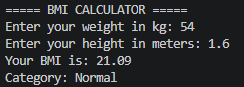
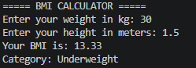
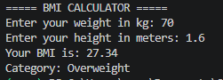
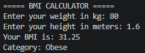

# BMI Calculator

## Project Overview

This project is a command-line BMI (Body Mass Index) Calculator developed using Python.

The program accepts the user's weight in kilograms and height in meters, calculates the BMI, and classifies the result into standard BMI categories.

This project was developed as part of the **Oasis Infobyte Python Programming Internship**.

## Objective

The objective of this project is to build a Python program that:

- Accepts the user's weight in kilograms.
- Accepts the user's height in meters.
- Calculates BMI using the BMI formula.
- Classifies the BMI into different categories.
- Displays the BMI rounded to two decimal places.
- Validates user input and provides helpful error messages.

## Technologies Used

- Python
- `input()`
- `float()`
- Basic arithmetic operations
- `if`, `elif`, and `else`
- `try` and `except`

## BMI Formula

BMI is calculated using the following formula:

**BMI = Weight (kg) / Height² (m²)**

Where:

- **Weight** = Body weight in kilograms (kg)
- **Height** = Height in meters (m)

### Example

If:

- Weight = 54 kg
- Height = 1.6 m

Then:

**BMI = 54 / (1.6 × 1.6)**

**BMI = 21.09**

## BMI Categories

| BMI Range | Category |
|-----------|----------|
| Less than 18.5 | Underweight |
| 18.5 – 24.9 | Normal |
| 25 – 29.9 | Overweight |
| 30 or above | Obese |

## Features

- User input for weight in kilograms.
- User input for height in meters.
- BMI calculation.
- BMI rounded to two decimal places.
- BMI category classification.
- Validation for non-numeric input.
- Validation for zero and negative values.
- Helpful error messages.

## Input Validation

The program handles invalid inputs using `try` and `except`.

### Non-numeric Input

If the user enters text instead of a number:

```text
===== BMI CALCULATOR =====
Enter your weight in kg: abc

Error: Please enter numeric values only.
```

### Negative Weight

```text
===== BMI CALCULATOR =====
Enter your weight in kg: -2
Enter your height in meters: 1.6

Error: Weight must be greater than zero.
```

### Negative Height

```text
===== BMI CALCULATOR =====
Enter your weight in kg: 54
Enter your height in meters: -2

Error: Height must be greater than zero.
```

## How to Run

### 1. Clone the repository

```bash
git clone https://github.com/varsha3620/OIBSIP.git
```

### 2. Navigate to the project folder

```bash
cd OIBSIP/Python-Task3-BMICalculator
```

### 3. Run the program

```bash
python bmi_calculator.py
```

### 4. Enter your weight and height

Follow the instructions displayed in the terminal.

## Example Output

### Normal

```text
===== BMI CALCULATOR =====
Enter your weight in kg: 54
Enter your height in meters: 1.6
Your BMI is: 21.09
Category: Normal
```

### Underweight

```text
===== BMI CALCULATOR =====
Enter your weight in kg: 30
Enter your height in meters: 1.5
Your BMI is: 13.33
Category: Underweight
```

### Overweight

```text
===== BMI CALCULATOR =====
Enter your weight in kg: 70
Enter your height in meters: 1.6
Your BMI is: 27.34
Category: Overweight
```

### Obese

```text
===== BMI CALCULATOR =====
Enter your weight in kg: 80
Enter your height in meters: 1.6
Your BMI is: 31.25
Category: Obese
```


## Testing

The program was tested with:

- Valid numeric weight and height.
- Underweight BMI.
- Normal BMI.
- Overweight BMI.
- Obese BMI.
- Negative weight.
- Negative height.
- Non-numeric input.

## Screenshots

### Normal BMI



### Underweight BMI



### Overweight BMI



### Obese BMI



## Project Structure

```text
Python-Task3-BMICalculator/
│
├── bmi_calculator.py
├── README.md
├── .gitignore
│
└── screenshots/
    ├── normal.png
    ├── underweight.png
    ├── overweight.png
    └── obese.png
```

## Internship Task

**Organization:** Oasis Infobyte

**Track:** Python Programming

**Task:** BMI Calculator

**Level:** Beginner Tier

## Author

**Varsha P**

## Conclusion

The BMI Calculator successfully calculates Body Mass Index based on the user's weight and height and classifies the result into the appropriate BMI category.

The project demonstrates basic Python programming concepts such as user input, arithmetic operations, conditional statements, exception handling, and input validation.