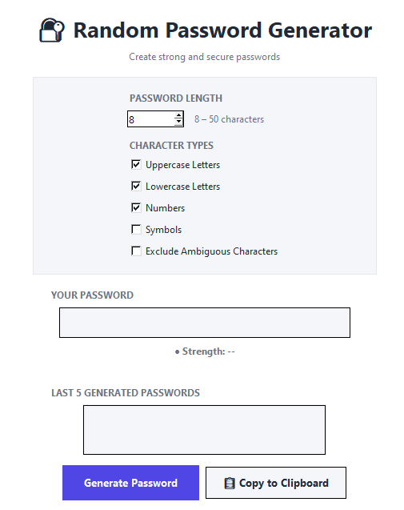
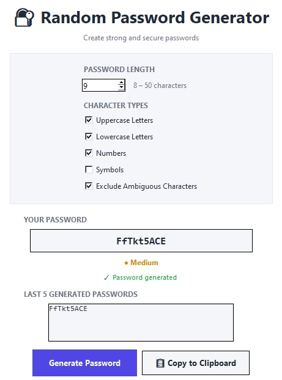
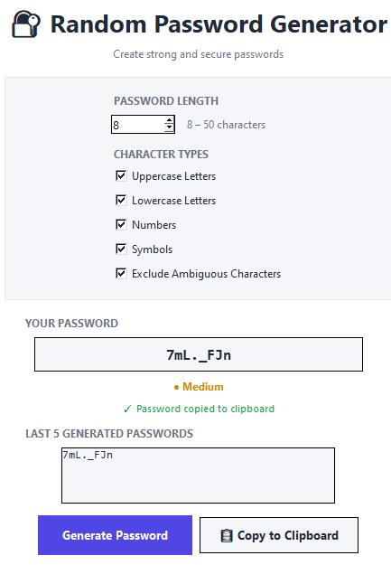
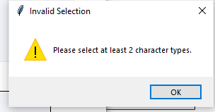

# Random Password Generator

A secure and user-friendly **Random Password Generator** built with Python and Tkinter. The application allows users to generate strong passwords based on selected character types and provides additional features such as password strength checking, clipboard copying, ambiguous character exclusion, and password history.

## Features

- Generate secure random passwords
- Select password length from **8 to 50 characters**
- Choose from:
  - Uppercase letters
  - Lowercase letters
  - Numbers
  - Symbols
- Requires at least **2 character types**
- Guarantees at least one character from each selected type
- Uses Python's `secrets` module for secure password generation
- Password strength indicator:
  - Weak
  - Medium
  - Strong
- Automatically copies generated passwords to the clipboard
- **Copy to Clipboard** button
- Option to exclude ambiguous characters such as:
  - `0`
  - `O`
  - `1`
  - `l`
  - `I`
- Displays the **last 5 generated passwords**
- Password history is stored only during the current session
- Clean and simple graphical user interface

## Technologies Used

- **Python**
- **Tkinter** – Graphical User Interface
- **Secrets** – Secure random password generation
- **String** – Character sets
- **Pyperclip** – Clipboard functionality

## Project Structure

```text
Python-Task3-Random-Password-Generator/
│
├── password_generator.py
├── README.md
│
└── screenshot/
    ├── s1.png
    ├── s2.png
    ├── s3.png
    └── s4.png
```

## Installation

# Clone the repository

```bash
git clone https://github.com/varsha3620/OIBSIP.git
```

# 2. Navigate to the project folder

cd Python-Task3-Random-Password-Generator

# Install the required package

pip install pyperclip

# How to Run

python password_generator.py

# Project Type

OIBSIP – Python Programming Internship

Task: Random Password Generator

Level: Advanced

# Author

Varsha P

# System Architecture

```text
┌──────────────────────────────────────────────┐
│              USER INTERFACE                  │
│ Password Length | Character Type Selection   │
│ Exclude Ambiguous | Generate / Copy Buttons  │
└──────────────────────┬───────────────────────┘
                       ▼
┌──────────────────────────────────────────────┐
│              INPUT VALIDATION                │
│ Check password length and at least 2 types   │
└──────────────────────┬───────────────────────┘
                       ▼
┌──────────────────────────────────────────────┐
│         PASSWORD GENERATION ENGINE           │
│ Character selection | Guaranteed types       │
│ Ambiguous character filtering | Shuffling   │
└──────────────────────┬───────────────────────┘
                       ▼
┌──────────────────────────────────────────────┐
│             PASSWORD ANALYSIS                │
│              Weak / Medium / Strong          │
└──────────────────────┬───────────────────────┘
                       ▼
┌──────────────────────────────────────────────┐
│              OUTPUT & STORAGE                │
│ Display password | Copy to clipboard        │
│ Last 5 passwords (session only)              │
└──────────────────────────────────────────────┘
```

## Example

The user can select the password length and required character types. 
The application then generates a secure password, displays its strength,
automatically copies it to the clipboard, and stores the latest five
generated passwords for the current session.

### Example

```text
Password Length: 12

☑ Uppercase Letters
☑ Lowercase Letters
☑ Numbers
☑ Symbols
☐ Exclude Ambiguous Characters

Generated Password:
K7@mQ2x!Lp9Z

Strength: Strong

✓ Password generated & copied

## Screenshot









# Author

Varsha P

## Conclusion

The Random Password Generator successfully provides a secure and user-friendly way to create strong passwords. The application uses Python's `secrets` module for secure password generation and Tkinter for the graphical user interface.

Users can customize password length and character types, exclude ambiguous characters, check password strength, copy passwords to the clipboard, and view their last five generated passwords.

Overall, the project demonstrates the practical use of Python programming, GUI development, security concepts, and user input validation in a real-world application.
